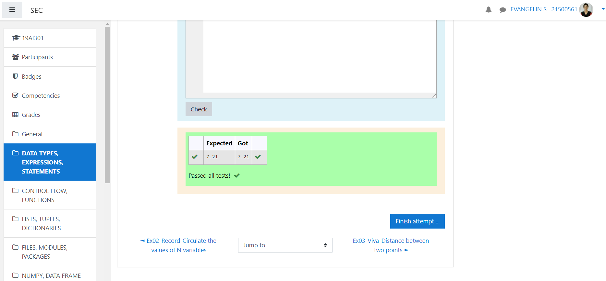

# DISTANCE-BETWEEN-TWO-POINTS

## AIM:
To write a python program to find the distance two points
## ALGORITHM:
### Step 1: import math library
### Step 2: assign the values for d1 and d2
### Step 3: 
Substitute the values in the distance formula  
### Step 4: print the values
### Step 5: end the program 
### PROGRAM:
  ```
  import math 
d1=[10,6]
d2=[4,2]
distance=math.sqrt(((d2[0]-d1[0])**2)+((d2[1]-d1[1])**2))
print("{:.2f}".format(distance))
```


### OUTPUT:



### RESULT:
thus the program to find distance between two points is successfully executed
